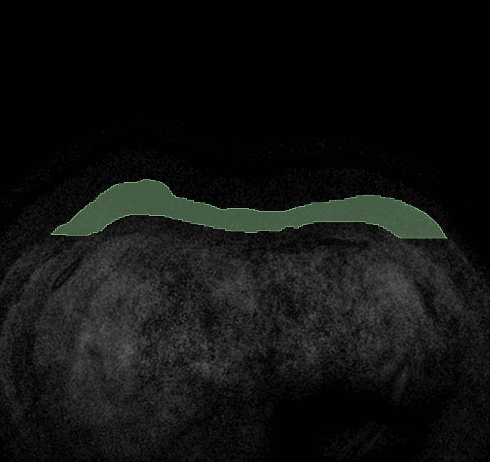
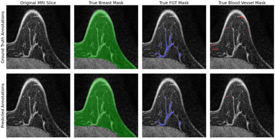
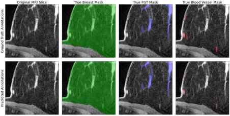
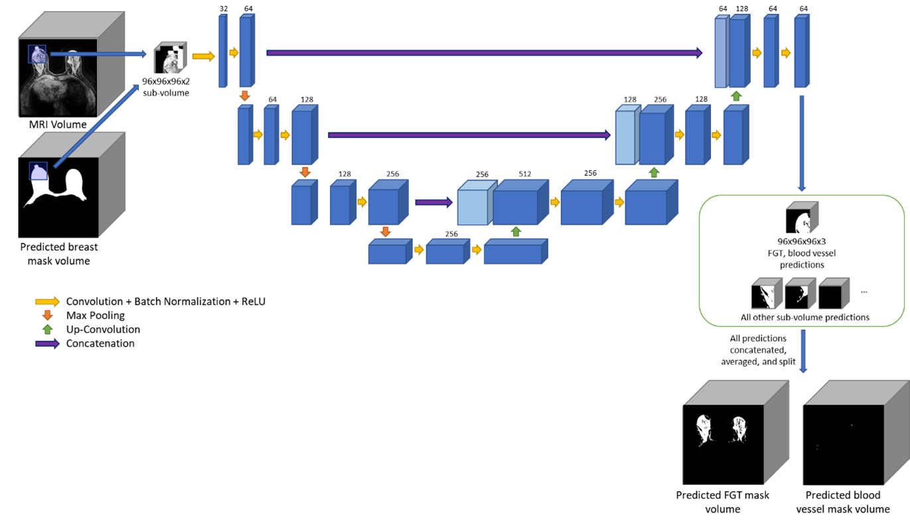

# Segmentation of breast and fibroglandular tissue in MRI: a publicly available dataset and deep learning model

This repository contains the source code and trained models for the research study titled "Segmentation of breast and fibroglandular tissue in MRI: a publicly available dataset and deep learning model". 

Breast density, or the amount of fibroglandular tissue (FGT) present relative to overall breast volume, has been shown to increase the risk of developing breast cancer. Although previous studies have utilized deep learning to assess breast density, the limited public availability of data and quantitative tools hinder the development of better assessment tools. Our objective was to (1) create and share a large dataset of pixel-wise annotations according to well-defined criteria, and (2) develop, evaluate, and share an automated segmentation method for breast, FGT, and blood vessels using convolutional neural networks. 

Dense tissue and FGT are used interchangeably throughout the documentation. 



## Prerequisites

The code contained in this repository can be run using Python 3 with the dependencies listed in the `requirements.txt` file
```
sudo pip install -r requirements.txt
```

## Usage

### Dataset

The data used in this study was taken from the publicly available Dynamic contrast-enhanced magnetic resonance images of breast cancer patients with tumor locations (Duke-Breast-Cancer-MRI) which is available at https://doi.org/10.7937/TCIA.e3sv-re93. 

We randomly selected 100 patients from the above dataset to perform full 3D volume, pixel-wise annotations that were reviewed by breast radiology fellowship-trained board-certified radiologists. The annotations are available online for public use at https://doi.org/10.7937/TCIA.e3sv-re93, under “Data Access”, “Supplemental Segmentation”, “3D Breast and FGT MRI Segmentation Supplemental Data”.  

### Preprocessing

Preprocessing is accomplished by using the functions in `preprocessing.py`. A brief sample on how to use these functions to preprocess your data can be found in `Preprocessing Sample.ipynb`. In order to utilize the code in preprocessing, the data must be the same as that which can be found in the publicly available dataset or a similar format. If the preprocessing is not used, then the MRI volumes should be intensity normalized and stored as .npy files. Masks should be stored also as .npy files if they will be used for training. 

### Pretrained model

The pretrained model for breast segmentation can be found at `trained_models/breast_model.pth`.
The pretrained weights for FGT and blood vessel segmentation can be found at `trained_models/dv_model.pth`.

### Training

Training can be accomplished by using the functions within `train.py` and the datasets within `dataset_3d.py`. Our study trains two convolutional neural networks. The first network performs breast segmentation. The second network uses the predicted breast mask with image data to perform FGT and blood vessel segmentation. Training can also be accomplished by using the following bash commands. These commands will begin training a model with the same dataset and hyperparameters used in our study, but with a smaller batch size as GPU memory can be greatly limiting. 

For training a breast model:
```
python train_model.py --target-tissue breast --train-image TRAINING_MRI_DATA_DIR --val-image VAL_MRI_DATA_DIR --train-mask TRAINING_MASK_DIR --val-mask VAL_MASK_DIR --model-save-dir SAVE_MODEL_DIR --model-save-name SAVE_MODEL_NAME
```

For training a FGT and blood vessel model:

```
python train_model.py --target-tissue dv --train-image TRAINING_MRI_DATA_DIR --val-image VAL_MRI_DATA_DIR --train-mask TRAINING_MASK_DIR --val-mask VAL_MASK_DIR --train-input-mask TRAIN_INPUT_MASK_DIR --val-input-mask VAL_INPUT_MASK_DIR --model-save-dir SAVE_MODEL_DIR --model-save-name SAVE_MODEL_NAME
```

### Prediction

Using either a trained model or our pretrained models, predictions can be done on an MRI volume as long as it is stored as a .npy file. The predictions will be saved at the original resolution of the input MRI volume. This process consumes a large amount of memory (RAM) when performing the FGT and blood vessel predictions because it needs to predict many subvolumes across the entire full volume. As these individual subvolumes are predicted, they need to be stored, resulting in high RAM usage. This can be lowered by reducing `x_y_divisions` and `z_division` parameters. 

Predict breast masks:
```
python predict.py --target-tissue breast --image MRI_DATA --save-masks-dir DIRECTORY_TO_SAVE_PREDICTIONS --model-save-path TRAINED_MODEL_PATH
```

Predict FGT and blood vessel masks:
```
python predict.py --target-tissue dv --image MRI_DATA --input-mask INPUT_MASKS --save-masks-dir DIRECTORY_TO_SAVE_PREDICTIONS --model-save-path TRAINED_MODEL_PATH
```

### Evaluation
To evaluate the performance of predictions, you can compare .npy files for the true and predicted masks. 

To evaluate breast masks:
```
python evaluate.py --target-tissue breast --true-mask TRUE_MASK_DIR --predicted-mask PREDICTED_MASK_DIR
```

To evaluate FGT and blood vessel masks:
```
python evaluate.py --target-tissue dv --true-mask TRUE_MASK_DIR --predicted-mask PREDICTED_MASK_DIR
```

## Results

These are some examples of the model's predictions. 




## U-Net architecture

The figure below shows a U-Net architecture used in the FGT and blood vessel predictions.

